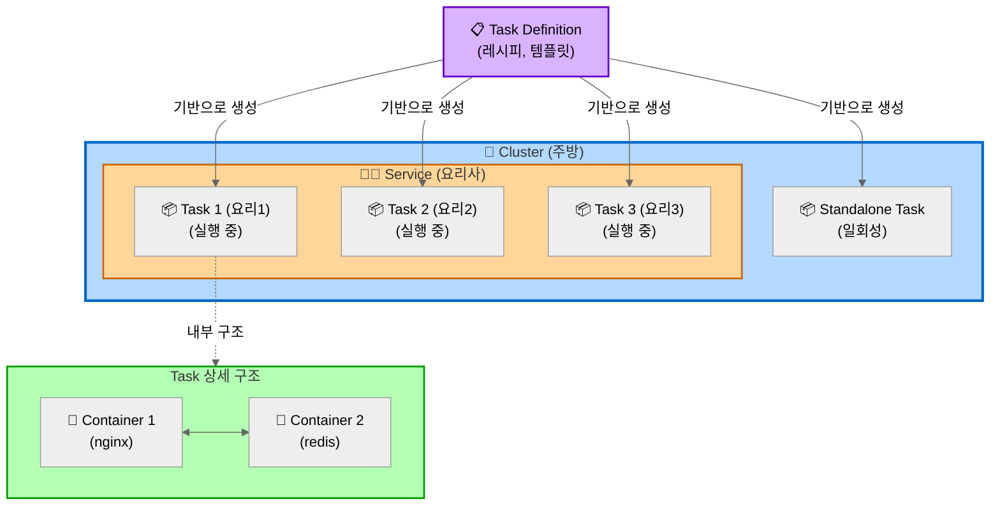
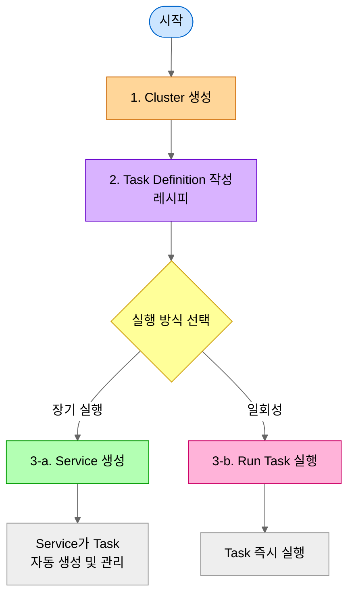

# ECS (Elastic Container Service)

## 한 줄 요약
Docker 컨테이너를 실행하고 관리하는 AWS 서비스

## 비유로 이해하기
- **EC2**: 가상 컴퓨터 한 대 (Windows나 Linux가 설치된 서버)
- **ECS**: 컨테이너 관리자 (Docker 컨테이너들을 돌리는 플랫폼)

## 핵심 개념
1. **Task Definition**: 레시피 (어떤 Docker 이미지를 사용할지, 메모리는 얼마나 필요한지 등)
2. **Task**: 실제 실행 중인 컨테이너 (레시피를 보고 만든 요리)
3. **Service**: 요리사 (레시피를 보고 Task를 계속 만들어내고, 죽으면 다시 만듦)
4. **Cluster**: 주방 (Task들이 실행되는 논리적 공간)

 

## 개념 및 관계도

### 다이어그램

**설명:**
- **Cluster (주방)**: 모든 리소스를 담는 논리적 그룹
- **Service (요리사)**: Task Definition(레시피)을 보고 Task를 계속 만들어냄, Desired Count 유지, 자동 재시작
- **Task Definition (레시피)**: Task 생성을 위한 템플릿
- **Task (요리)**: Task Definition을 기반으로 생성된 실제 실행 인스턴스
- **Standalone Task**: Service 없이 직접 실행하는 일회성 작업
- **Container**: Task 안에서 실행되는 Docker 컨테이너들

### 관계 요약
1. **Cluster** 안에 **Service**와 **Task**가 실행됨
2. **Task Definition** (템플릿)을 기반으로 **Task** (실제 실행)가 생성됨
3. **Service**는 여러 **Task**를 관리하고 개수 유지
4. **Task**는 1개 이상의 **Container**로 구성됨
5. Standalone **Task**는 Service 없이 일회성으로 직접 실행 가능

### 생성 순서

**각 단계 바로가기:**
- [1. Cluster 생성](#생성-방법-aws-console)
- [2. Task Definition 작성](#생성-방법-1)
- [3-a. Service 생성](#생성-방법-2)
- [3-b. Task 직접 실행](#task)
 

## 왜 사용하나?
- Docker 컨테이너를 수동으로 관리하지 않아도 됨
- 컨테이너가 죽으면 자동으로 재시작
- 로드밸런서, 오토스케일링 쉽게 연동
- Fargate 사용 시 서버 관리 없이 컨테이너만 실행 가능
