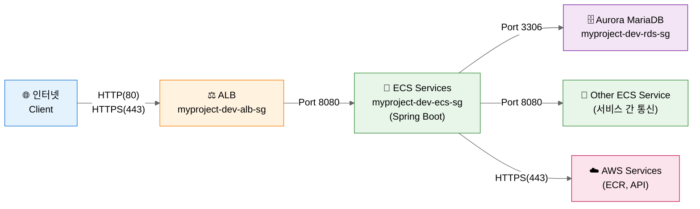

## 개념 및 관계도

## Cluster

- ECS 리소스(Task, Service, Container Instance)들을 논리적으로 그룹핑하는 단위
- 하나의 클러스터 안에서 여러 서비스와 태스크를 실행하고 관리함
- 리전별로 독립적으로 존재하며, VPC와 연결됨

### 생성 방법 (AWS Console)

1. ECS 대시보드 접속
2. **Clusters** 메뉴 선택
3. **Create Cluster** 버튼 클릭
4. 설정:
  - **Cluster configuration**:
    - Cluster name: 예: `myproject-dev`

      <details>
        <summary>Naming Convention (MSA 구조 예시)</summary>

        **프로젝트 구조:**
        - 프로젝트: myproject
        - 환경: dev, prod
        - 서비스: user-service, order-service, payment-service

        **Cluster 이름:**
        - 형식: `{project}-{environment}`
        - 예시: `myproject-dev`, `myproject-prod`
        - 규칙:
          - 소문자만 사용 (대문자 사용 불가)
          - 하이픈(`-`)으로 구분
          - 환경별 분리 권장 (stg, prod)
      </details>

- **Infrastructure**:
  - **AWS Fargate (권장)**: 서버리스, 인프라 관리 불필요, 빠른 시작
  - Amazon EC2 instances: 대규모 장기 실행, 특수 요구사항 (GPU, 커스텀 AMI)
- **Monitoring**: skip!
- **Encryption**: skip!
- **Tag** (추가 권장):
  - `Environment`: `dev`, `prod`
  - `Project`: `myproject`
  - `ManagedBy`: `terraform` 또는 `manual`
5. **Create** 버튼 클릭


### 참고: Fargate vs EC2 Launch Type

| 항목 | Fargate | EC2 |
|------|---------|-----|
| 인프라 관리 | AWS 완전 관리 | 사용자가 EC2 관리 |
| 과금 | Task 리소스 사용량 기준 | EC2 인스턴스 실행 시간 기준 |
| 유연성 | 제한적 | 높음 (커스텀 AMI, GPU 등) |
| 시작 속도 | 빠름 | 상대적으로 느림 |
| 사용 사례 | 마이크로서비스, 배치 작업 | 대규모 장기 실행, 특수 요구사항 |

<br/>

## Task
- Task Definition의 실제 실행 인스턴스
- 하나 이상의 Docker 컨테이너로 구성됨
- Task Definition에 정의된 대로 컨테이너를 실행함
- 일회성 작업(Run Task, [Standalone Task](#standalone-task-일회성)) 또는 장기 실행(Service, [Task Definition](#task-definition-장기실행))으로 실행 가능

- Docker와의 관계
  - Task 실행 = Task Definition에 정의된 Docker 컨테이너들을 실제로 기동
  - ECS Agent가 Docker 이미지를 pull하고 컨테이너 시작
  - 각 Task는 독립적인 네트워크 인터페이스(ENI) 할당 가능 (awsvpc 모드)

### Standalone Task (일회성)

#### 실행 방법 (AWS Console)
1. Cluster 선택
2. **Tasks** 탭 → **Run new Task** 클릭
3. Launch type 선택 (Fargate or EC2)
4. Task Definition 선택 (Family와 Revision)
5. Cluster 선택
6. 네트워킹 설정
   - VPC 선택
   - Subnets 선택 (public 또는 private)
   - Security groups 설정
   - Public IP 자동 할당 여부 (public subnet에서 인터넷 접근 시 필요)
7. Task 개수 입력
8. **Create** 클릭


### Task Definition (장기실행)

- Task를 실행하기 위한 청사진(템플릿)
- Docker 이미지, CPU/메모리, 네트워킹, IAM 역할 등을 정의함
- Task Definition의 각 버전은 revision으로 관리됨
- 한 Task Definition에 여러 컨테이너를 정의 가능 (최대 10개)

#### 사전 준비: Docker 연결
- **컨테이너 이미지**: Docker Hub, Amazon ECR, 기타 레지스트리에서 이미지 지정

#### 생성 방법 (AWS Console)

1. ECS 대시보드 접속
2. **Task Definitions** 메뉴 선택
2. **Create new Task Definition** 버튼 클릭
3. 설정:
  - Task definition configuration:
    - Task Definition Family: 예: `myproject-user-api-dev`

    <details>
      <summary>Naming Convention (MSA 구조 예시)</summary>

      **프로젝트 구조:**
      - 프로젝트: myproject
      - 환경: dev, prod
      - 서비스: user-api, order-api, email-batch

      **Task Definition Family 이름:**
      - 형식: `{project}-{service}-{type}-{env}`
      - 예시: `myproject-user-api-dev`, `myproject-email-batch-prod`
      - 규칙:
        - 소문자만 사용
        - 하이픈(`-`)으로 구분
        - 서비스 단위로 Task Definition 분리

    </details>

  - **Infrastructure requirements**:
    - Launch Type
      - **AWS Fargate**(권장): 서버리스, 인프라 관리 불필요, 빠른 시작
      - Amazon EC2 instances: 대규모 장기 실행, 특수 요구사항 (GPU, 커스텀 AMI)
    - Operating system/Architecture: Linux/X86_64 (default)
    - Task size: (시스템 요구사항에 따라 선택)
      - CPU: 1 vCPU
      - Memory: 2GB
    - Task role: ecsTaskExecutionRole
    - Task execution role: ecsTaskExecutionRole
  - **Container-1**:
    - Container details: 
      - Name: 예: `app`

      <details>
        <summary>Naming Convention (MSA 구조 예시)</summary>

      **프로젝트 구조:**
      - 프로젝트: myproject

        **Container 이름:**
        - 형식: `{role}`
        - 예시: `app`, `nginx`, `fluentd`
        - 규칙:
          - 소문자만 사용
          - 서비스의 주요 역할이나 이름

      </details>

      - Essential container: Yes (at least one essential container)
      - Image URI: Browse ECR Images > Select an image
      - Private registry: disabled
      - Port mappings: 
        - Container port: 8080
        - Protocol: tcp
        - Port name: 예: `user-api-tcp`
        - App protocol: 8080
      - Resource allocation limits
        - CPU: Task가 사용할 vCPU (가상 CPU)
          - Fargate 옵션: 0.25, 0.5, 1, 2, 4, 8, 16 vCPU
          - 권장: 시작은 0.5 vCPU, 모니터링 후 조정
        - Memory: Task가 사용할 메모리
          - Hard Limit (memory): 절대 넘을 수 없는 한계, 이 값을 초과하면 컨테이너 강제 종료 (OOM Killed)
          - Soft Limit (memoryReservation): 보장받는 최소 메모리
          
            <details>
            <summary>💡 CPU/Memory 선택 가이드</summary>
            
            **개발 환경 (dev):**
            - CPU: 0.25 vCPU
            - Memory: 0.5GB
            - 용도: 테스트, 비용 절감
            
            **스테이징 (stg):**
            - CPU: 0.5 vCPU
            - Memory: 1GB
            - 용도: 프로덕션과 유사한 환경
            
            **프로덕션 (prod) - 일반 API:**
            - CPU: 1 vCPU
            - Memory: 2GB
            - 용도: 대부분의 웹 애플리케이션
            
            **프로덕션 (prod) - 높은 부하:**
            - CPU: 2+ vCPU
            - Memory: 4GB+
            - 용도: CPU/메모리 집약적 작업
            
            **Memory Hard/Soft Limit 설정:**
            - **단일 컨테이너**: Hard만 설정 (Soft는 불필요)
            - **여러 컨테이너**: 각각 Soft 설정, Task 전체 Hard는 합계
            - 예) Task Memory 2GB, 2개 컨테이너
              - Container 1: Soft 1GB
              - Container 2: Soft 512MB
              - 총 Hard: 2GB
            
            **모니터링 후 조정:**
            - CloudWatch에서 CPU/Memory 사용률 확인
            - 80% 이상 지속 시 증가 고려
            - 30% 이하 지속 시 감소 고려

            **중요**: 이 값은 **Task 1개당 리소스**
            - Service에서 Task 3개 실행 시 = CPU 0.5 × 3 = 1.5 vCPU 총 사용
            - Auto Scaling은 Task 개수 조정, 여기는 Task 크기 설정
            
            </details>

    - **Environment variables**: skip!
      - **Logging**:
        - Use log collection: check
        - Destination: Amazon CloudWatch
          - key: awslogs-group, value: /ecs/hhlaw-dev/user-api (`/{aws-service}/{cluster-name}/{service-name}`)
          - key: awslogs-region, value: ap-southeast-2 
          - key: awslogs-stream-prefix, value: ecs
  - Storage: skip!
  - Monitoring: skip!
  - Tags: skip!

4. **Create** 버튼 클릭

<br/>

## Service

- 지정된 개수의 Task를 지속적으로 실행하고 유지하는 관리 단위
- Task가 실패하면 자동으로 재시작하여 desired count 유지
- Load Balancer와 통합하여 트래픽 분산 가능
- Auto Scaling과 연동하여 동적으로 Task 개수 조정 가능
- Rolling update, Blue/Green 배포 전략 지원

### 생성 방법 (AWS Console)

1. ECS 대시보드 접속
2. **Clusters** 메뉴 선택
3. Service를 생성할 cluster 선택
4. **Services** 탭으로 이동
5. **Create** 버튼 클릭
6. 설정:
  - **Service details**
    - Task definition family: 리스트에서 선택
    - Service name: 예: 

    <details>
      <summary>Naming Convention (MSA 구조 예시)</summary>

      **프로젝트 구조:**
      - 프로젝트: myproject
      - 환경: dev, prod
      - 서비스: user-api, order-api, email-batch

      **Service name 이름:**
      - 형식: `{service}-{type}`
      - 예시: `user-api`, `order-api`, `email-batch`
      - 규칙:
        - 소문자만 사용
        - 하이픈(`-`)으로 구분
    </details>

  - **Environment**
   - Compute options: Launch type 
    - Launch type: Fargate
    - Platform version: Latest

  - **Deployment configuration**
    - Schedule strategy: Replica
    - Desired tasks: 예: dev는 1, prod는 3
    - Availability Zone Re-balancing: check
    - Health check grace period: 0
    - Deployment options:
      - Deployment controller type: ECS
      - Deployment strategy: Rolling Update
      - Min running tasks: 100%
      - Max running tasks: 200%
  - **Networking**
    - VPC 선택
   - Subnets 선택 (가용성을 위해 여러 AZ 선택 권장)
   - Security group: Use an exsiting security group/Create a new security group

<details>
<summary>🔒 Security Group 전략 가이드</summary>

**기본 원칙:**
- 서비스별로 개별 SG 생성하지 않음 (관리 복잡도 증가)
- 환경별 + 계층별로 SG 공유 (간단하고 효율적)
- 모든 ECS Service는 동일한 ECS SG 사용

**Naming Convention:**
```
형식: {project}-{environment}-{layer}-sg

예시:
- myproject-dev-alb-sg      (ALB용)
- myproject-dev-ecs-sg      (모든 ECS Service 공유)
- myproject-dev-rds-sg      (RDS용)
- myproject-prod-alb-sg
- myproject-prod-ecs-sg
- myproject-prod-rds-sg
```

**구조 다이어그램:**


**구조 예시 (Dev/Prod - Spring Boot + Aurora MariaDB):**

### 1. ALB Security Group: `myproject-dev-alb-sg`

**Inbound Rules:**
| Name | IP version | Type | Protocol | Port range | Source | Description |
|------|------------|------|----------|------------|--------|-------------|
| HTTPS | IPv4 | HTTPS | TCP | 443 | 0.0.0.0/0 | HTTPS from Internet |
| HTTP | IPv4 | HTTP | TCP | 80 | 0.0.0.0/0 | HTTP redirect to HTTPS |

**Outbound Rules:**
| Name | IP version | Type | Protocol | Port range | Destination | Description |
|------|------------|------|----------|------------|-------------|-------------|
| Spring Boot | IPv4 | Custom TCP | TCP | 8080 | myproject-dev-ecs-sg | To ECS Spring Boot |

### 2. ECS Security Group: `myproject-dev-ecs-sg` (모든 서비스 공유)

**Inbound Rules:**
| Name | IP version | Type | Protocol | Port range | Source | Description |
|------|------------|------|----------|------------|--------|-------------|
| From ALB | IPv4 | Custom TCP | TCP | 8080 | myproject-dev-alb-sg | ALB to Spring Boot |
| Service to Service | IPv4 | Custom TCP | TCP | 8080 | myproject-dev-ecs-sg | Inter-service communication |

**Outbound Rules:**
| Name | IP version | Type | Protocol | Port range | Destination | Description |
|------|------------|------|----------|------------|-------------|-------------|
| HTTPS | IPv4 | HTTPS | TCP | 443 | 0.0.0.0/0 | ECR, AWS API access |
| Aurora MariaDB | IPv4 | MYSQL/Aurora | TCP | 3306 | myproject-dev-rds-sg | Database connection |
| Service to Service | IPv4 | Custom TCP | TCP | 8080 | myproject-dev-ecs-sg | Inter-service communication |

### 3. RDS Security Group: `myproject-dev-rds-sg`

**Inbound Rules:**
| Name | IP version | Type | Protocol | Port range | Source | Description |
|------|------------|------|----------|------------|--------|-------------|
| From ECS | IPv4 | MYSQL/Aurora | TCP | 3306 | myproject-dev-ecs-sg | Aurora MariaDB from ECS |

**Outbound Rules:**
- (기본 outbound 규칙만 유지, 추가 불필요)

**⚠️ 보안 주의사항:**
- ECS에 `0.0.0.0/0` 직접 노출 금지 (보안 위험)
- 반드시 ALB를 통해서만 접근
- 개발 환경에서도 ALB 사용 권장
- 로컬 테스트는 포트 포워딩 사용

**예외: 개발 환경에서 직접 접근이 필요한 경우**
```
❌ 나쁜 예: Port 8080 from 0.0.0.0/0 (전 세계 노출)
⚠️ 차선책: Port 8080 from {your-office-ip}/32 (특정 IP만)
✅ 권장: ALB 사용 + HTTPS
```

**서비스별 SG가 필요한 경우 (예외):**
- 특정 서비스만 외부 IP에서 직접 접근
- 금융/결제 등 규제 요구사항
- 서비스 간 완전 격리 필요

</details>

   - Public IP: Turned on


8. **Create** 버튼 클릭

<br/>
