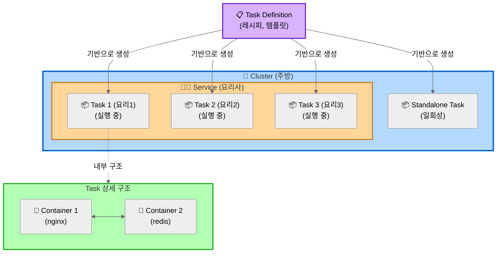
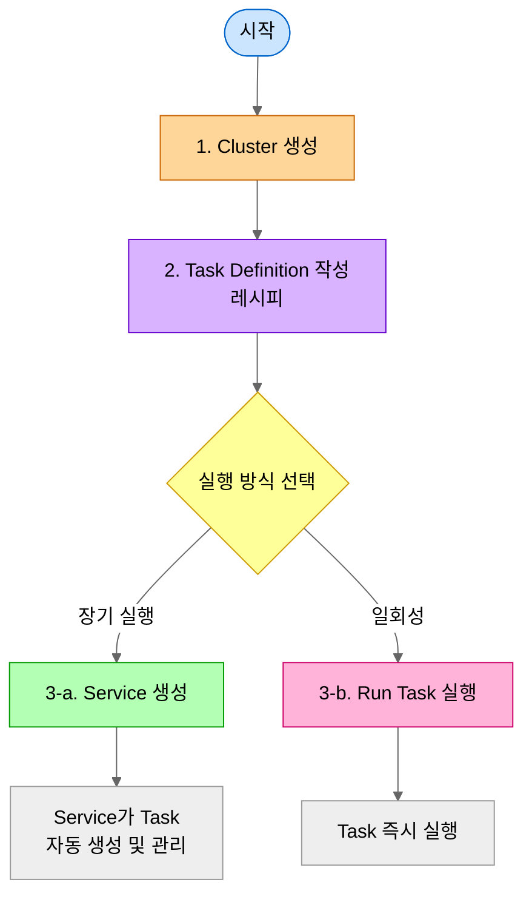

## 개념 및 관계도

### 다이어그램



**설명:**
- **Cluster (주방)**: 모든 리소스를 담는 논리적 그룹
- **Service (요리사)**: Task Definition(레시피)을 보고 Task를 계속 만들어냄, Desired Count 유지, 자동 재시작
- **Task Definition (레시피)**: Task 생성을 위한 템플릿
- **Task (요리)**: Task Definition을 기반으로 생성된 실제 실행 인스턴스
- **Standalone Task**: Service 없이 직접 실행하는 일회성 작업
- **Container**: Task 안에서 실행되는 Docker 컨테이너들

### 관계 요약
1. **Cluster** 안에 **Service**와 **Task**가 실행됨
2. **Task Definition** (템플릿)을 기반으로 **Task** (실제 실행)가 생성됨
3. **Service**는 여러 **Task**를 관리하고 개수 유지
4. **Task**는 1개 이상의 **Container**로 구성됨
5. Standalone **Task**는 Service 없이 일회성으로 직접 실행 가능

### 생성 순서



**각 단계 바로가기:**
- [1. Cluster 생성](#생성-방법-aws-console)
- [2. Task Definition 작성](#생성-방법-1)
- [3-a. Service 생성](#생성-방법-2)
- [3-b. Task 직접 실행](#task)

<br/>

## Cluster

### 개념
- ECS 리소스(Task, Service, Container Instance)들을 논리적으로 그룹핑하는 단위
- 하나의 클러스터 안에서 여러 서비스와 태스크를 실행하고 관리함
- 리전별로 독립적으로 존재하며, VPC와 연결됨

### 생성 방법 (AWS Console)

1. ECS 대시보드 접속
2. **Clusters** 메뉴 선택
3. **Create Cluster** 버튼 클릭
4. 설정:
  - **Cluster configuration**:
    - Cluster name: 예: `myproject-stg-cluster`

      <details>
        <summary>Naming Convention (MSA 구조 예시)</summary>

        **프로젝트 구조:**
        - 프로젝트: myproject
        - 환경: dev, stg, prod
        - 서비스: user-service, order-service, payment-service

        **Cluster 이름:**
        - 형식: `{project}-{environment}-cluster`
        - 예시: `myproject-stg-cluster`, `myproject-prod-cluster`
        - 규칙:
          - 소문자만 사용 (대문자 사용 불가)
          - 하이픈(`-`)으로 구분
          - 환경별 분리 권장 (stg, prod)
      </details>

- **Infrastructure**:
  - **AWS Fargate (권장)**: 서버리스, 인프라 관리 불필요, 빠른 시작
  - Amazon EC2 instances: 대규모 장기 실행, 특수 요구사항 (GPU, 커스텀 AMI)
- **Monitoring**: skip!
- **Encryption**: skip!
- **Tag** (추가 권장):
  - `Environment`: `stg`, `prod`
  - `Project`: `myproject`
  - `ManagedBy`: `terraform` 또는 `manual`
5. **Create** 버튼 클릭

<br/>

## Task Definition

### 개념
- Task를 실행하기 위한 청사진(템플릿)
- Docker 이미지, CPU/메모리, 네트워킹, IAM 역할 등을 정의함
- Task Definition의 각 버전은 revision으로 관리됨
- 한 Task Definition에 여러 컨테이너를 정의 가능 (최대 10개)

### Docker 연결
- **컨테이너 이미지**: Docker Hub, Amazon ECR, 기타 레지스트리에서 이미지 지정
- **포트 매핑**: 컨테이너 포트와 호스트 포트 매핑 정의
- **환경 변수**: 컨테이너 실행 시 필요한 환경 변수 설정
- **볼륨**: 컨테이너 간 데이터 공유를 위한 볼륨 마운트 설정

### 생성 방법 (AWS Console)

1. ECS 대시보드 접속
2. **Task Definitions** 메뉴 선택
2. **Create new Task Definition** 버튼 클릭
3. 설정:
  - Task definition configuration:
    - Task Definition Family: 예: `myproject-user-service-stg`

    <details>
      <summary>Naming Convention (MSA 구조 예시)</summary>

      **프로젝트 구조:**
      - 프로젝트: myproject
      - 환경: dev, stg, prod
      - 서비스: user-service, order-service, payment-service

      **Task Definition Family 이름:**
      - 형식: `{project}-{service}-{environment}`
      - 예시: `myproject-user-service-stg`, `myproject-order-service-prod`
      - 규칙:
        - 소문자만 사용
        - 하이픈(`-`)으로 구분
        - 서비스 단위로 Task Definition 분리

    </details>

  - Infrastructure requirements:
    - Launch Type
      - **AWS Fargate (권장)**: 서버리스, 인프라 관리 불필요, 빠른 시작
      - Amazon EC2 instances: 대규모 장기 실행, 특수 요구사항 (GPU, 커스텀 AMI)
    - Operating system/Architecture: Linux/X86_64
    - Task size: (시스템 요구사항에 따라 선택)
      - CPU: 1 vCPU
      - Memory: 2GB
    - Task role: ecsTaskExecutionRole
    - Task execution role: ecsTaskExecutionRole
  - Container-1:
    - Container details: 
      - Name: 예: `user-service-container`

      <details>
        <summary>Naming Convention (MSA 구조 예시)</summary>

      **프로젝트 구조:**
      - 프로젝트: myproject
      - 환경: dev, stg, prod
      - 서비스: user-service, order-service, payment-service

        **Container 이름:**
        - 형식: `{service}-container`
        - 예시: `user-service-container`, `order-service-container`
        - 규칙:
          - 소문자만 사용
          - 하이픈(`-`)으로 구분
          - 서비스 단위로 container 분리

      </details>

      - Essential container: Yes (at least one essential container)
      - Image URI: Browse ECR Images > Select an image
      - Private registry: disabled
      - Port mappings: 
        - Container port: 8080
        - Protocol: tcp
        - Port name: 예: `user-service-tcp`
        - App protocol: 8080
      - CPU: skip!
    - Logging:
      - Destination: Amazon CloudWatch
        - key: / value: 
  - Storage:
  - Monitoring:
  - Tags:

4. 인프라 요구사항
   - CPU: 예) 0.25 vCPU, 0.5 vCPU, 1 vCPU
   - Memory: 예) 0.5GB, 1GB, 2GB
   - Task Role: Task가 AWS 서비스 호출 시 사용할 IAM 역할
   - Task Execution Role: ECS가 Task를 시작할 때 사용할 IAM 역할
5. 컨테이너 정의
   - Container name 입력 (예: `user-service-container`)
   - Image URI: 예) `123456789.dkr.ecr.ap-northeast-2.amazonaws.com/myproject/user-service:v1.0.0`
   - Port mappings: 예) Container port 80, Protocol TCP
   - Environment variables: KEY=VALUE 형식으로 추가
   - HealthCheck: 컨테이너 상태 확인 명령어 설정
6. 로깅 설정
   - Log driver: awslogs (CloudWatch Logs)
   - Log group: `/ecs/myproject/user-service/stg`
7. 스토리지 (선택사항)
   - Ephemeral storage: 임시 저장소 크기 설정
   - Volume: EFS, Bind mount 등 볼륨 추가
8. **Create** 버튼 클릭

<br/>

## Task

### 개념
- Task Definition의 실제 실행 인스턴스
- 하나 이상의 Docker 컨테이너로 구성됨
- Task Definition에 정의된 대로 컨테이너를 실행함
- 일회성 작업(Run Task) 또는 장기 실행(Service)으로 실행 가능

### Docker와의 관계
- Task 실행 = Task Definition에 정의된 Docker 컨테이너들을 실제로 기동
- ECS Agent가 Docker 이미지를 pull하고 컨테이너 시작
- 각 Task는 독립적인 네트워크 인터페이스(ENI) 할당 가능 (awsvpc 모드)

### 실행 방법

#### Standalone Task (일회성)
1. Cluster 선택
2. **Tasks** 탭 → **Run new Task** 클릭
3. Launch type 선택 (Fargate or EC2)
4. Task Definition 선택 (Family와 Revision)
5. Cluster 선택
6. 네트워킹 설정
   - VPC 선택
   - Subnets 선택 (public 또는 private)
   - Security groups 설정
   - Public IP 자동 할당 여부 (public subnet에서 인터넷 접근 시 필요)
7. Task 개수 입력
8. **Create** 클릭

<br/>

## Service

### 개념
- 지정된 개수의 Task를 지속적으로 실행하고 유지하는 관리 단위
- Task가 실패하면 자동으로 재시작하여 desired count 유지
- Load Balancer와 통합하여 트래픽 분산 가능
- Auto Scaling과 연동하여 동적으로 Task 개수 조정 가능
- Rolling update, Blue/Green 배포 전략 지원

### 주요 기능
- **Desired count**: 원하는 Task 실행 개수
- **Load balancing**: ALB/NLB와 통합
- **Service Discovery**: AWS Cloud Map 연동으로 서비스 간 통신
- **Deployment configuration**: 배포 시 최소/최대 Task 비율 설정

### 생성 방법

#### Naming Convention (MSA 구조 예시)

**Service 이름:**
- 형식: `{project}-{service}-{environment}`
- 예시: `myproject-user-service-stg`, `myproject-order-service-prod`
- 규칙:
  - 소문자만 사용
  - 하이픈(`-`)으로 구분
  - Task Definition Family와 동일한 이름 사용 권장

**MSA 구조 예시:**
```
Cluster: myproject-stg-cluster
├── Service: myproject-user-service-stg (Task 2개 실행)
│   └── Task Definition: myproject-user-service-stg:3
├── Service: myproject-order-service-stg (Task 3개 실행)
│   └── Task Definition: myproject-order-service-stg:5
└── Service: myproject-payment-service-stg (Task 2개 실행)
    └── Task Definition: myproject-payment-service-stg:2
```

**Desired Count 권장:**
- **Dev**: 1개 (비용 절감)
- **Staging**: 2개 (가용성 확보)
- **Production**: 3개 이상 (고가용성, 여러 AZ 분산)

#### AWS Console
1. Cluster 선택 → **Services** 탭
2. **Create** 버튼 클릭
3. 환경 설정
   - Compute options: Launch type (Fargate) or Capacity provider
   - Launch type 선택 시: FARGATE 또는 EC2
4. Deployment configuration
   - Application type: Service
   - Task Definition: Family와 Revision 선택 (예: `myproject-user-service-stg:3`)
   - Service name 입력 (예: `myproject-user-service-stg`)
   - Desired tasks: 실행할 Task 개수 (예: stg는 2, prod는 3)
5. 네트워킹
   - VPC 선택
   - Subnets 선택 (가용성을 위해 여러 AZ 선택 권장)
   - Security groups 설정
   - Public IP 자동 할당 여부
6. Load balancing (선택사항)
   - Load balancer type: Application Load Balancer
   - 기존 ALB 선택 또는 새로 생성
   - Target group 설정
   - Health check grace period: Task 시작 후 헬스체크 대기 시간
7. Service auto scaling (선택사항)
   - Minimum tasks
   - Maximum tasks
   - Scaling policy: Target tracking (CPU/Memory), Step scaling
8. **Create** 버튼 클릭

<br/>

## ECR (Elastic Container Registry)

### 개념
- AWS에서 제공하는 완전 관리형 Docker 컨테이너 레지스트리
- Docker 이미지를 저장, 관리, 배포함
- ECS Task Definition에서 ECR 이미지 참조 가능
- Private repository로 접근 제어 가능

### 사용 방법

#### Naming Convention (MSA 구조 예시)

**ECR Repository 이름:**
- 형식: `{project}/{service}`
- 예시: `myproject/user-service`, `myproject/order-service`
- 규칙:
  - 소문자만 사용
  - 슬래시(`/`)로 프로젝트와 서비스 구분
  - 환경별 분리 불필요 (태그로 구분)

**Image Tag:**
- **Semantic Versioning**: `v1.0.0`, `v1.2.3`
- **Git SHA**: `abc1234` (짧은 commit hash)
- **환경 + 버전**: `stg-v1.0.0`, `prod-v1.0.0`
- **날짜 + 버전**: `20240115-v1.0.0`

**ECR 구조 예시:**
```
123456789.dkr.ecr.ap-northeast-2.amazonaws.com/
├── myproject/user-service:v1.0.0
├── myproject/user-service:v1.1.0
├── myproject/order-service:v2.0.0
└── myproject/payment-service:v1.5.0
```

#### ECR Repository 생성 및 이미지 푸시
- AWS Console에서 ECR 서비스 접속
- **Create repository** 클릭
- Repository 이름 입력 (예: `myproject/user-service`)
- 로컬에서 Docker 이미지 빌드
- ECR에 로그인 후 이미지 푸시

#### Task Definition에서 ECR 이미지 사용
- Task Definition 생성 시 Image URI에 ECR 이미지 경로 입력
- 형식: `123456789.dkr.ecr.ap-northeast-2.amazonaws.com/myproject/user-service:v1.0.0`

<br/>

## Container Instance (EC2 Launch Type)

### 개념
- EC2 launch type 사용 시, Task를 실행하는 EC2 인스턴스
- ECS Agent가 설치되어 있어 클러스터와 통신함
- Fargate 사용 시에는 Container Instance 관리 불필요

### 주요 특징
- ECS-optimized AMI 사용 권장 (Docker, ECS Agent 사전 설치됨)
- 클러스터에 등록되어 Task 배치 가능한 리소스로 활용됨
- CPU, 메모리, 네트워크 리소스를 Task에 할당함

### 등록 방법

#### ECS-optimized AMI로 EC2 생성
1. EC2 콘솔에서 인스턴스 시작
2. AMI 선택: Amazon ECS-Optimized Amazon Linux 2
3. IAM Role 지정: `ecsInstanceRole` 필요
4. User data에 클러스터 등록 스크립트 추가
5. Security group 설정
6. 인스턴스 시작

<br/>

## 참고: 주요 개념 비교

### Fargate vs EC2 Launch Type

| 항목 | Fargate | EC2 |
|------|---------|-----|
| 인프라 관리 | AWS 완전 관리 | 사용자가 EC2 관리 |
| 과금 | Task 리소스 사용량 기준 | EC2 인스턴스 실행 시간 기준 |
| 유연성 | 제한적 | 높음 (커스텀 AMI, GPU 등) |
| 시작 속도 | 빠름 | 상대적으로 느림 |
| 사용 사례 | 마이크로서비스, 배치 작업 | 대규모 장기 실행, 특수 요구사항 |

### 네트워크 모드
- **awsvpc**: 각 Task가 독립적인 ENI 보유 (Fargate 필수)
- **bridge**: Docker 기본 브리지 네트워크 사용 (EC2만 가능)
- **host**: 호스트 네트워크 직접 사용 (EC2만 가능)
- **none**: 네트워크 없음

### 배포 전략
- **Rolling Update**: 점진적으로 Task 교체 (기본값)
- **Blue/Green**: AWS CodeDeploy 연동하여 전환
- **External**: 외부 배포 컨트롤러 사용